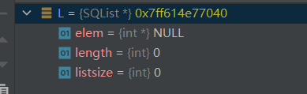

# Data Structure

八周的数据结构结课了，但是感觉自己对于数据结构的理解和掌握还不是特别透彻，所以从4月开始从头开始看一遍数据结构的书并在这过程中将算法都实现一下（由于学校教的太少，所以我会把数据结构全部学习一遍）

大致内容包括七章

1. 线性表
2. 栈和队列
3. 串、数组和广义表
4. 树和二叉树
5. 图
6. 查找
7. 排序

**希望在疫情这段时间里我可以学完，珍惜时光，一寸光阴一寸金**

**由于时间有限，我可能只会记录一些对我来说比较难的问题和我新学到的或者对新手容易混淆东西**

-----

# Chaper1-线性表

### 第一个问题就是对于（*L）的理解

比如在顺序表中

```c 
伪代码: Statu InitList(SqList &L)
 //实际操作
  Statu InitList(SqList *L)
{
      (*L).elem = (ELemType*)malloc(INIT_SIZE * sizeof (ELemType));
    if(!L->elem)exit(OVERFLOW);
    L->length = 0;
    L->listsize = INIT_SIZE;
    return OK;
}
typedef struct {
    ELemType *elem;
    int length;
    int listsize;
}SQList;
```

 我们之前已经初始化了一个`SqList L`	此时，系统给这个**L**分配了一个空间

我们可以看出此时空间已经分配好

然后我们执行` Statu InitList(SqList *L)`	这时注意我们传入的是*L而不是L，为什么呢？

其实本质是函数形参和实参的区别

当我们传入一个函数形参的时候，函数会新开辟一个栈内存，然后在这个栈内存里面进行一系列函数操作，函数运行结束后，自动释放该栈内存。

所以当我们传入L，我们初始化函数进行的一系列操作都是在另外开辟的栈内存里进行操作，而我们最初的L并没有任何改变。所以我们就需要用指针*L，在执行malloc函数的时候对L进行解引用运算，以确保我们是在L的地址下操作！

这个地方之后双指针也是一个道理！


